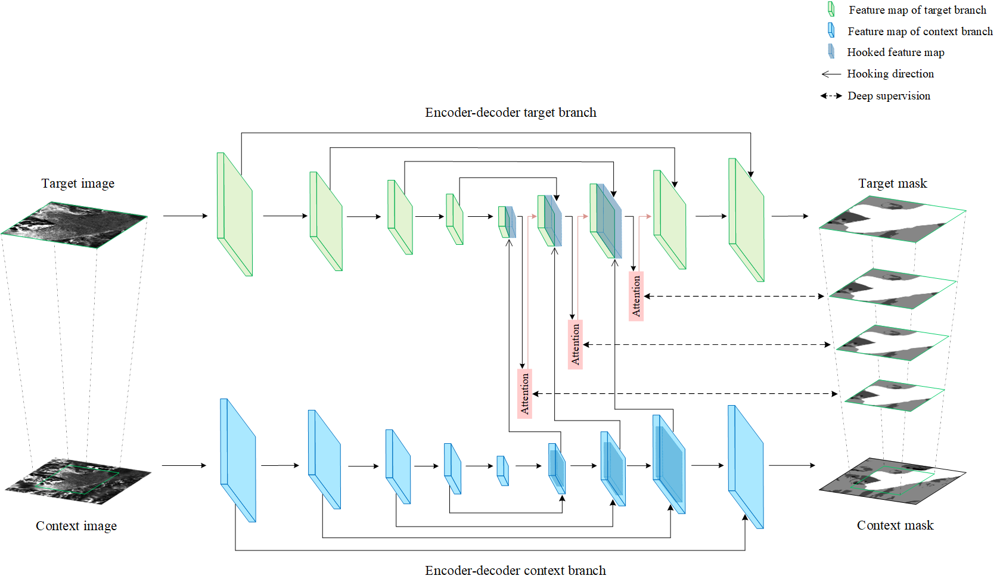

# AMD-HookNet
This repository includes the codes for the paper:
 
[**AMD-HookNet for Glacier Front Segmentation**](https://ieeexplore.ieee.org/abstract/document/10044700?casa_token=3IBssDCNHvUAAAAA:I09Eu8V-jG-rEXCTf-LQ73Ay3CJcqilJ1na-SKr7FiptD8dGb2R0Inkm9K4UN22ZjucnwvVwiw), accepted by *IEEE TGRS*

Fei Wu, Nora Gourmelon, Thorsten Seehaus, Jianlin Zhang, Matthias Braun, Andreas Maier, and Vincent Christlein



### Abstract
Knowledge on changes in glacier calving front positions is important for assessing the status of glaciers. Remote sensing imagery provides the ideal database for monitoring calving front positions, however, it is not feasible to perform this task manually for all calving glaciers globally due to time-constraints. Deep learning-based methods have shown great potential for glacier calving front delineation from optical and radar satellite imagery. The calving front is represented as a single thin line between the ocean and the glacier, which makes the task vulnerable to inaccurate predictions. The limited availability of annotated glacier imagery leads to a lack of data diversity (not all possible combinations of different weather conditions, terminus shapes, sensors, etc. are present in the data), which exacerbates the difficulty of accurate segmentation. In this paper, we propose Attention-Multi-hooking-Deep-supervision HookNet (AMD-HookNet), a novel glacier calving front segmentation framework for synthetic aperture radar (SAR) images. The proposed method aims to enhance the feature representation capability through multiple information interactions between low-resolution and high-resolution inputs based on a two-branch U-Net. The attention mechanism, integrated into the two branch U-Net, aims to interact between the corresponding coarse and fine-grained feature maps. This allows the network to automatically adjust feature relationships, resulting in accurate pixel-classification predictions. Extensive experiments and comparisons on the challenging glacier segmentation benchmark dataset CaFFe show that our AMD-HookNet achieves a mean distance error of 438m to the ground truth outperforming the current state of the art by 42%, which validates its effectiveness.

### Preprocessing
Prepare training/validation/testing datasets based on [CaFFe](https://github.com/Nora-Go/Calving_Fronts_and_Where_to_Find_Them), run center_crop.py, Sliding_window_generate_dataset.py, generate_target_context.py accordingly.

### Inference
Please refer to [CaFFe](https://github.com/Nora-Go/Calving_Fronts_and_Where_to_Find_Them) which offers a uniform standard postprocessing and analyzing tool for evaluating experimental results.
### License
Licensed under an MIT license.

### Citation
If you find this work useful for your research, please consider citing our work:
```
@ARTICLE{10044700,
  author={Wu, Fei and Gourmelon, Nora and Seehaus, Thorsten and Zhang, Jianlin and Braun, Matthias and Maier, Andreas and Christlein, Vincent},
  journal={IEEE Transactions on Geoscience and Remote Sensing}, 
  title={AMD-HookNet for Glacier Front Segmentation}, 
  year={2023},
  volume={61},
  number={},
  pages={1-12},
  doi={10.1109/TGRS.2023.3245419}}

@Article{essd-14-4287-2022,
  AUTHOR = {Gourmelon, N. and Seehaus, T. and Braun, M. and Maier, A. and Christlein, V.},
  TITLE = {Calving fronts and where to find them: a benchmark dataset and methodology for automatic glacier calving front extraction from synthetic aperture radar imagery},
  JOURNAL = {Earth System Science Data},
  VOLUME = {14},
  YEAR = {2022},
  NUMBER = {9},
  PAGES = {4287--4313},
  URL = {https://essd.copernicus.org/articles/14/4287/2022/},
  DOI = {10.5194/essd-14-4287-2022}}
```
